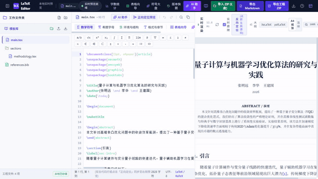

  
  <h1>LaTeX Editor</h1>
  
<strong>面向控制、自动化与工程论文作者的 AI 辅助 LaTeX 工作台</strong>

  
Source editing, live rendering, project files, structured AI actions, and research-writing shortcuts in one local workspace.

> Independent open-source software. It is not affiliated with, endorsed by, or an official product of IEEE or IEEE Transactions on Automatic Control.

## Why this project

LaTeX Editor is for researchers who maintain multi-file technical-paper projects and want a practical workspace instead of a generic chat window. It combines a source editor, rendered reading view, project-file operations, mathematical tools, and an optional LLM gateway that can propose structured editor actions.

The first release is especially useful for Chinese/English control and engineering manuscripts, including IEEE-style document structures. It does not claim an official relationship with IEEE, and it does not replace a native TeX distribution for final submission builds.

## 30-second product tour

| Time | What is shown |
| --- | --- |
| 00:00–00:10 | A multi-file LaTeX workspace with source editing and rendered preview |
| 00:10–00:20 | The AI assistant and TAC-oriented research-writing shortcuts |
| 00:20–00:30 | Importing a ZIP paper project into the local workspace |

Additional unedited product screenshots are stored in [public](public): [workspace](public/latex-editor-workspace.jpg), [AI assistant](public/latex-editor-ai-assistant.jpg), and [project import](public/latex-editor-project-import.jpg).

## Features

- **Source-to-preview workflow** — syntax-highlighted LaTeX editing, rendered preview, source/preview navigation, document outline, and diagnostics.
- **Paper-project workspace** — folders, multi-file projects, templates, snapshots, ZIP import/export, Markdown export, and a word-count view.
- **Mathematical writing tools** — equation, symbol, table, TikZ, theorem, algorithm, citation, and reference helpers.
- **Optional LLM actions** — configurable provider gateway returns structured suggestions to write, insert, create, update, delete, or switch project files.
- **Optional local Zotero bridge** — search a user-run Zotero MCP service, insert citation keys, and append reviewed BibTeX entries inside the managed workspace.
- **Control-paper shortcuts** — prompts for a problem thesis, introduction logic, theorem narrative, notation audit, and review checklist; these are convenience prompts, not editorial certification.
- **Research-friendly examples** — three small, downloadable demonstrations under [examples](examples).

## Quick start

### Prerequisites

- Node.js 20 or later
- npm 10 or later
- An API key only if you want an external LLM provider

### Run locally

~~~powershell
git clone https://github.com/marcowus/latex-editor.git
cd latex-editor
npm ci
Copy-Item .env.example .env
~~~

Edit only the local .env file and configure a provider if needed. Then start the application:

~~~powershell
npm run dev
~~~

Open http://127.0.0.1:3000 in a browser.

For a production bundle:

~~~powershell
npm run build
npm start
~~~

The Windows helpers [start_latex_editor.bat](start_latex_editor.bat) and [stop_latex_editor.bat](stop_latex_editor.bat) are also included.

## API keys, privacy, and network exposure

- **Never commit a .env file.** The repository ignores .env, .env.local, and related variants; use [.env.example](.env.example) as the public template.
- API keys supplied through the settings interface are retained only by the running server process and are not echoed back in the configuration response.
- The default listening address is 127.0.0.1. To intentionally share the service on a trusted LAN, set LATEX_EDITOR_HOST=0.0.0.0 yourself and protect access.
- Content sent to an external LLM provider is subject to that provider's terms and data policy. Do not send unpublished manuscripts, credentials, or sensitive data unless you have assessed that risk.
- Use a native TeX toolchain for authoritative, submission-grade PDF compilation; the in-app preview is a writing aid.

Read the full [privacy and security notes](docs/PRIVACY_AND_SECURITY.md) and [security policy](SECURITY.md) before exposing the application outside your own machine.

## Examples and one-minute walkthroughs

| Example | Input | Expected outcome | Walkthrough |
| --- | --- | --- | --- |
| [IEEE control-paper skeleton](examples/ieee-control-paper) | A minimal multi-file IEEEtran manuscript | A clean modular manuscript structure to adapt | [60-second GIF](examples/ieee-control-paper/demo.gif) |
| [Diagnostics and repair](examples/latex-diagnostics) | A deliberately imperfect source and bibliography | A reviewable before/after repair checklist | [60-second GIF](examples/latex-diagnostics/demo.gif) |
| [TAC-oriented writing workflow](examples/tac-writing-workflow) | A small control-paper draft | Prompt-driven outline, theorem, and review workflow | [60-second GIF](examples/tac-writing-workflow/demo.gif) |

Each example contains its input, expected output, an actual one-minute GIF, and a repeatable recording script. The 30-second GIF above is the compact visual overview.

## Documentation

- [LLM API and action protocol](docs/LLM_API_GUIDE.md)
- [Privacy and security](docs/PRIVACY_AND_SECURITY.md)
- [Zotero MCP bridge](docs/ZOTERO_MCP.md)
- [Release checklist](docs/RELEASE_CHECKLIST.md)
- [Launch kit: Chinese and English copy](docs/LAUNCH_KIT.md)
- [Contributing](CONTRIBUTING.md)

## Roadmap

- [x] v0.1.0 — local LaTeX workspace, preview, project ZIP, LLM actions, and starter examples
- [ ] Native TeX-engine integration and compiler-log fidelity
- [ ] Reproducible template gallery for control, engineering, and thesis writing
- [ ] Contributor-maintained provider adapters and accessibility review
- [ ] Optional deployment guide with authentication and network hardening

## Community and feedback

Please use [GitHub Issues](https://github.com/marcowus/latex-editor/issues) for reproducible bugs and concrete feature proposals. See [CONTRIBUTING.md](CONTRIBUTING.md) for the contribution workflow. Do not include API keys, unpublished manuscripts, or personal data in an issue.

## Citation

If this software supports academic work, please use the citation metadata in [CITATION.cff](CITATION.cff). GitHub will surface it as “Cite this repository.”

## License

LaTeX Editor is released under the [Apache License 2.0](LICENSE).
