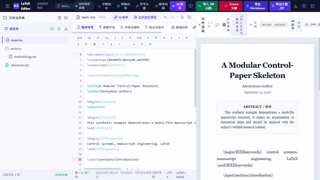

# IEEE control-paper skeleton

## Input

- main.tex is a minimal IEEEtran-style multi-file manuscript.
- sections/introduction.tex supplies the opening section.
- references.bib supplies the one cited background item.

## Expected output

When opened as a project, the reader should see a modular paper layout with a title, abstract, introduction, problem formulation, theorem/proof placeholder, and references. The example intentionally makes no scientific-performance claim; replace every placeholder before using it in a real manuscript.

## Suggested use

1. Import this folder as a ZIP project or open its files in the workspace.
2. Replace the bracketed scope, assumptions, and conclusion placeholders.
3. Use a native TeX installation to compile an authoritative submission PDF.

## 60-second walkthrough

The corresponding narration and timing are in [DEMO.md](DEMO.md).
