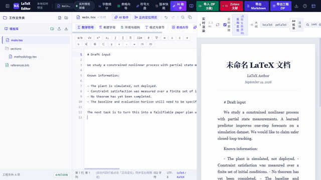

# TAC-oriented writing workflow

This example demonstrates the structure of the built-in control-paper shortcuts. The prompts are drafting aids; they do not verify novelty, theorem correctness, experimental validity, or compliance with a journal.

## Input

input-draft.md is a deliberately incomplete research description.

## Expected output

expected-outline.md separates a main thesis, argument dependencies, evidence needs, and limitations. command-sequence.md lists prompts to run in a responsible order.

## 60-second walkthrough

The corresponding narration and timing are in [DEMO.md](DEMO.md).
